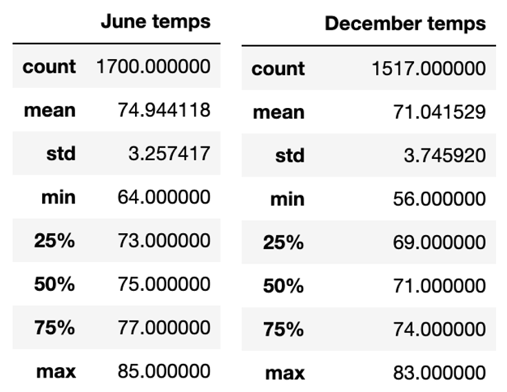
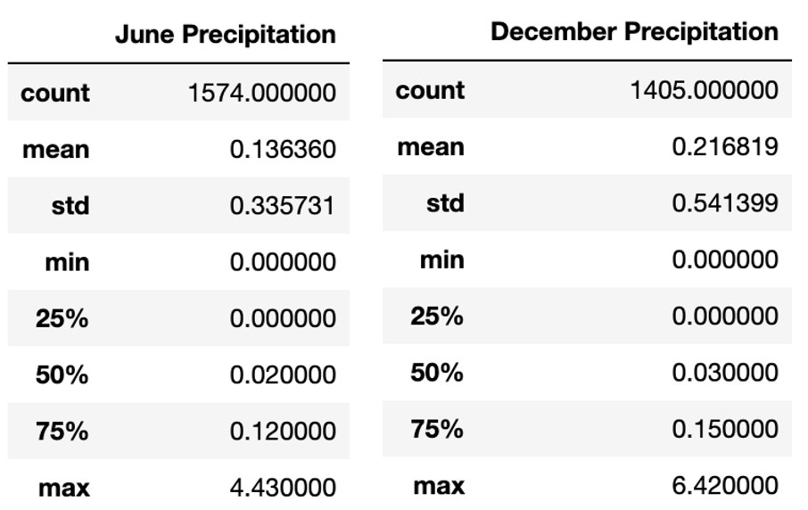

# Surfs_Up Challenge and Analysis
## Overview of the analysis 
The purpose of this analysis was to get more information on temperature trends in Hawaii. Specifically, June and December months were looked at to determine if a surf and ice cream shop business is sustainable year-round.
## Results:
The data for temperatures year-round is available from 2010 to 2016. June and December temperatures were compared first, based on the summary statistics.

The three major differences between June and December temperatures are:
-	The average temperature for June is higher by almost 4 degrees.
-	The temperature is December can fluctuate a little more than in June.
-	The minimum temperature in December is much lower than in June by 8 degrees.
Overall, the temperature stays somewhat consistent between June and December and this specific data does prove that a surf and ice cream shop business is sustainable year-round in Hawaii.

## Summary: 
Overall, the temperature stays somewhat consistent between June and December and this temperature data does prove that a surf and ice cream shop business is sustainable year-round in Hawaii. Two additional queries that can be performed to gather more weather data for June and December are queries that compare the precipitation in June and December. The final output as seen on this screenshot: 

Even though the month of December has more precipitation, there is not enough precipitation overall to really affect the running of the business. So, these additional queries still prove that a surf and ice cream shop business is sustainable year-round in Hawaii.
